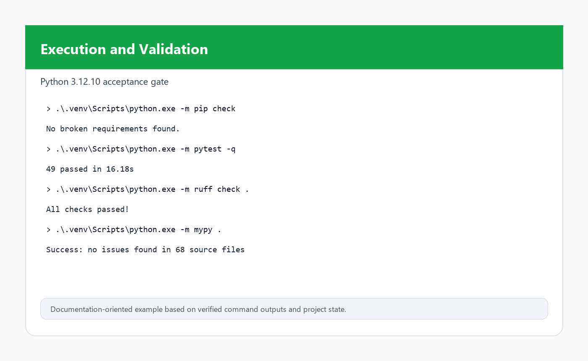
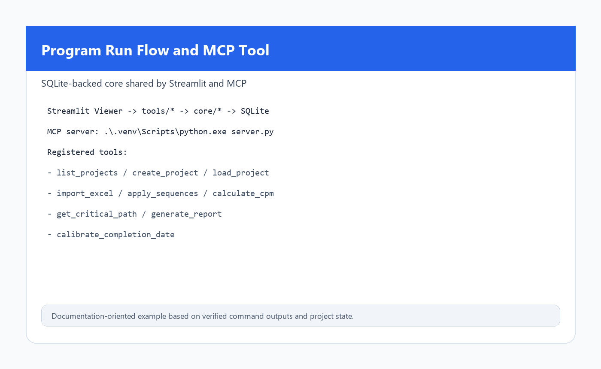
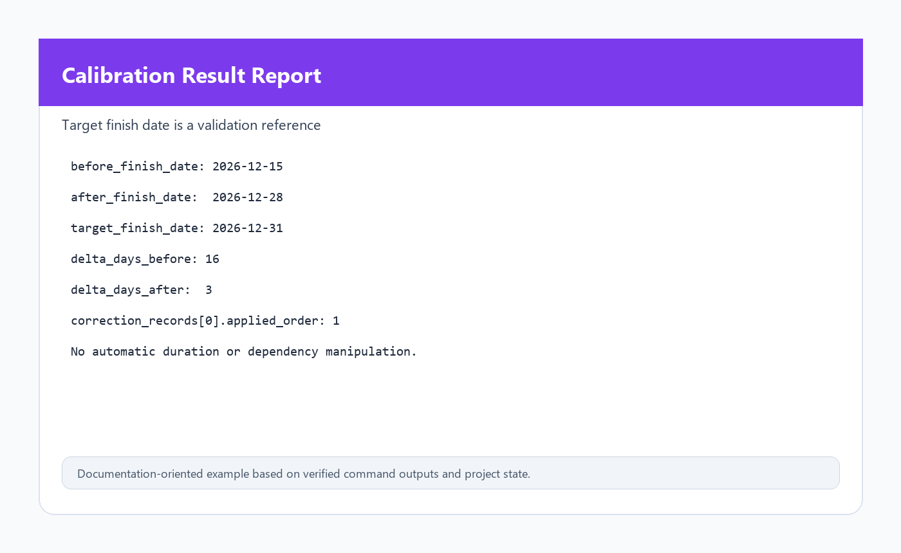
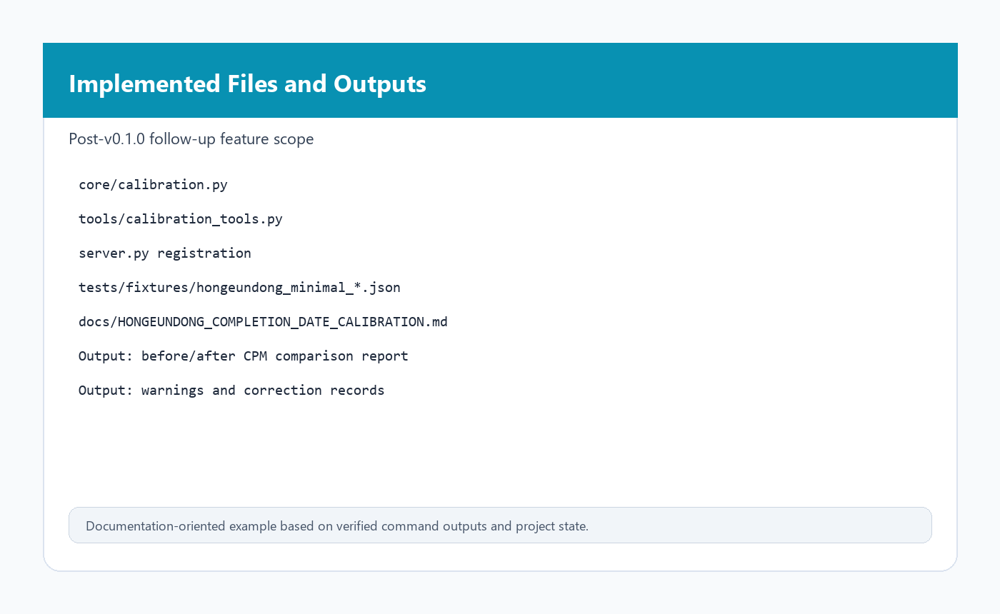
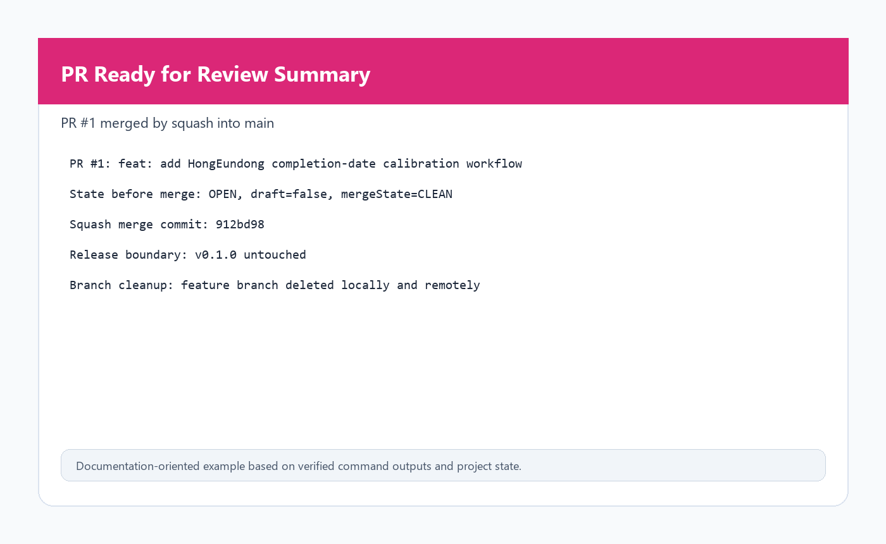
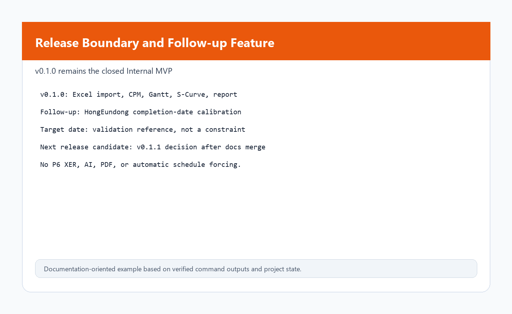

# Smart Node-Scheduler Execution Guide

## 1. Overview

Smart Node-Scheduler is a Python-based MEP schedule assistant. It stores project
data in SQLite, calculates CPM, maps workday offsets to Korean calendar dates,
serves MCP tools, provides a Streamlit Viewer, and generates Plotly Gantt,
S-Curve, and Excel reports.

This guide covers the verified v0.1.0 workflow plus the post-v0.1.0
HongEundong completion-date calibration workflow.

## 2. Environment Setup

Acceptance runs must use Python `>=3.11,<3.13`. Python 3.14 or Python 2.7
results are not acceptance evidence.

Windows setup:

```powershell
py -0p
py -3.12 --version
py -3.12 -m venv .venv

.\.venv\Scripts\python.exe --version
.\.venv\Scripts\python.exe -m pip install --upgrade pip setuptools wheel
.\.venv\Scripts\python.exe -m pip install -r requirements.txt
```

Do not add `python>=3.11` to `requirements.txt`. Runtime version limits belong
in `pyproject.toml`.

## 3. Validation Commands

Run all validation through the project virtual environment:

```powershell
.\.venv\Scripts\python.exe -m pip check
.\.venv\Scripts\python.exe -m pytest -q
.\.venv\Scripts\python.exe -m ruff check .
.\.venv\Scripts\python.exe -m mypy .
```

Latest verified main result after PR #1 merge:

```text
pip check: No broken requirements found.
pytest: 49 passed
ruff: All checks passed.
mypy: Success, no issues found in 68 source files
```

## 4. Basic Workflow

1. Create or load a `.scheduler` project.
2. Add WBS and activities.
3. Add FS, SS, or FF relationships with lag where needed.
4. Configure the Korean work calendar.
5. Calculate CPM.
6. Review Critical Path, Gantt, and S-Curve outputs.
7. Generate the five-sheet Excel report.

## 5. Excel Import Workflow

Use the Streamlit Viewer or MCP `import_excel` tool to import conceptual
schedule Excel files.

The importer supports both standard activity-table inputs and Korean timeline
schedule inputs. Korean timeline inputs can create activities, but files without
relationship or cost columns need user supplementation before the CPM finish date
and S-Curve should be treated as field-trust outputs.

Expected import review fields:

```text
import_mode
imported_activities
imported_relationships
warnings
failed_rows
```

## 6. Relationship and Cost Supplement Workflow

After importing a relationship-free or cost-free Excel file:

1. Review importer warnings.
2. Add missing relationships manually or through `apply_sequences`.
3. Add costs to activities or keep cost-free S-Curve limitations explicit.
4. Recalculate CPM.
5. Regenerate Gantt, S-Curve, and the Excel report.

Supported relationship types in v0.1 are `FS`, `SS`, and `FF`. `SF` remains out
of scope.

## 7. CPM / Gantt / S-Curve / Excel Report Generation

Run the Streamlit Viewer:

```powershell
.\.venv\Scripts\python.exe -m streamlit run viewer/app.py
```

Run the MCP server:

```powershell
.\.venv\Scripts\python.exe server.py
```

Generate an Excel report directly:

```powershell
.\.venv\Scripts\python.exe -c "from tools.report_tools import generate_report; print(generate_report('path\\to\\project.scheduler'))"
```

The Excel report contains:

1. Summary
2. WBS
3. Activity detail
4. Relationships
5. S-Curve data

Critical Path activities are highlighted in the Activity detail sheet.

## 8. HongEundong Completion-Date Calibration Workflow

The calibration workflow compares imported CPM results with explicitly
user-corrected CPM results.

Target finish date is a validation reference, not an automatic scheduling
constraint.

> Target finish date is a validation reference, not an automatic scheduling constraint.

현장 신뢰 준공일은 검증 기준이며, CPM 일정을 강제로 맞추기 위한 제약조건이 아니다.

Input example for `calibrate_completion_date`:

```json
{
  "project_id": "hongeundong",
  "target_finish_date": "2026-12-31",
  "dependency_overrides": [
    {
      "predecessor_id": "TASK-001",
      "successor_id": "TASK-002",
      "dependency_type": "FS",
      "lag_days": 0,
      "reason": "field sequence correction"
    }
  ],
  "duration_overrides": [],
  "lag_overrides": [],
  "notes": "HongEundong UAT completion-date calibration"
}
```

Output excerpt:

```json
{
  "before_finish_date": "2026-12-15",
  "after_finish_date": "2026-12-28",
  "target_finish_date": "2026-12-31",
  "delta_days_before": 16,
  "delta_days_after": 3,
  "critical_path_before": [],
  "critical_path_after": [],
  "correction_records": [
    {
      "applied_order": 1,
      "task_id": "TASK-002",
      "field": "dependency",
      "old_value": null,
      "new_value": "FS from TASK-001 + 0d",
      "reason": "field sequence correction",
      "source": "user_calibration"
    }
  ],
  "warnings": []
}
```

The workflow never silently overwrites the imported schedule. Calibration is
represented as an explicit user patch and comparison report.

## 9. MCP Tool Usage

The server registers these tools:

```text
list_projects
load_project
create_project
import_excel
apply_sequences
calculate_cpm
get_critical_path
generate_report
calibrate_completion_date
```

Use MCP Inspector or a connected MCP client to call the tools after starting:

```powershell
.\.venv\Scripts\python.exe server.py
```

## 10. Output Examples

Typical outputs include:

```text
SQLite project: *.scheduler
Excel report: reports/*.xlsx
Gantt figure: Plotly figure in Streamlit
S-Curve data: table and Plotly line chart
Calibration report: JSON/dict result from calibrate_completion_date
```

## 11. Screenshots

Screenshots are documentation-oriented examples based on verified command
outputs and project state.

본 스크린샷은 검증된 명령 결과와 프로젝트 상태를 바탕으로 만든 문서용 예시 화면입니다.

### 1. Execution and Validation



### 2. Program Run Flow and MCP Tool



### 3. Calibration Result Report



### 4. Implemented Files and Outputs



### 5. PR Ready for Review Summary



### 6. Release Boundary and Follow-up Feature



## 12. Known Limitations

- Relationship-free timeline Excel files require user relationship correction
  before CPM finish dates should be treated as field-trust dates.
- Cost-free Excel files produce empty or zero-value S-Curve outputs until costs
  are mapped or entered.
- Target finish date is not a constraint and never forces duration or dependency
  changes.
- P6 XER, AI recommendations, PDF output, resource leveling, and advanced
  constraints remain out of scope for this stage.
